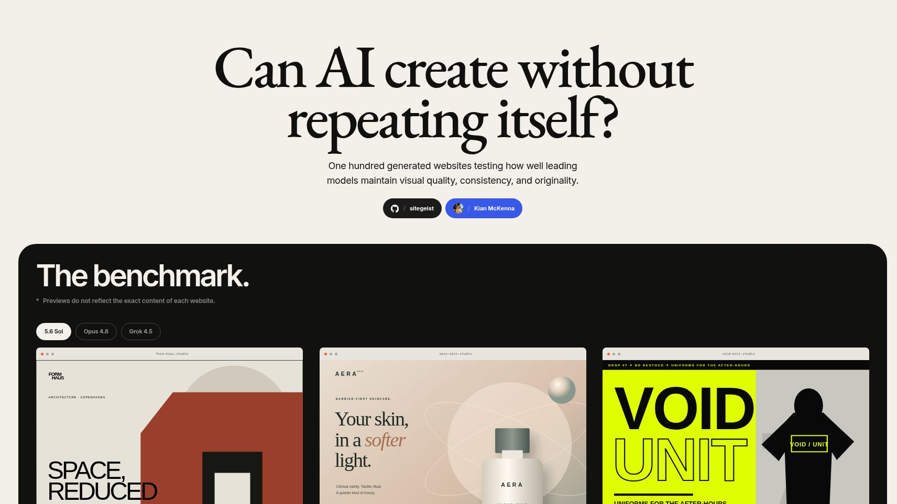

# Sitegeist



Sitegeist is a visual benchmark for a simple question: **when leading coding agents receive the same set of website briefs, how often do their design instincts converge?**

The project contains 100 neutral briefs and 300 complete, self-contained websites generated across three model collections:

- **5.6 Sol**
- **Opus 4.8**
- **Grok 4.5**

The gallery lets you move through every result, switch models, and compare up to three generations side by side.

## What makes the benchmark different

Each generation attempt runs in a fresh one-site filesystem. The worker receives only a neutral work order, a single private brief, and the artifact contract. It cannot see:

- the Sitegeist gallery or Git history;
- another model's result;
- prior websites from its own batch;
- screenshots, duplicate reports, or reviewer feedback from earlier attempts.

Accepted sites must provide authored source, a dependency-free static build, and a self-contained 4:3 gallery poster. The evaluator rejects remote assets, runtime network dependencies, symbolic links, malformed artifacts, console errors, and mobile horizontal overflow.

This does not make Sitegeist a subjective design leaderboard. It preserves the outputs and the generation boundary so people can inspect visual quality, recurring patterns, and exact duplication for themselves.

## Repository map

| Path | Purpose |
| --- | --- |
| [`benchmark/briefs/generated`](benchmark/briefs/generated) | The 100 model-neutral website briefs |
| [`benchmark/CONTRACT.md`](benchmark/CONTRACT.md) | Isolation rules and the submission artifact contract |
| [`benchmark/reports`](benchmark/reports) | Generation, mobile-runtime, code-volume, and duplicate-audit evidence |
| [`scripts/benchmark`](scripts/benchmark) | Isolated runners, reviewers, importers, and audit utilities |
| [`static/sites`](static/sites) | The canonical deployable website collections |
| [`.skills/add-model`](.skills/add-model) | Reusable workflow for adding another CLI/model collection |

Raw worker homes, credentials, logs, and temporary evaluator workspaces are not committed.

## Run the gallery locally

Requirements: Node.js and pnpm.

```sh
pnpm install
pnpm dev
```

Then open `http://localhost:5173`.

Production validation:

```sh
pnpm check
pnpm build
```

The application is built with SvelteKit and deployed through Cloudflare Workers.

## Audit a collection

The repository includes deterministic audits for exact source/build duplication, cross-model duplication, artifact volume, and final collection integrity. For example:

```sh
node scripts/benchmark/audit-cross-model-duplicates.mjs \
  --left-registry src/lib/generated/sol-site-artifacts.ts \
  --left-model "5.6 Sol" \
  --right-registry src/lib/generated/opus-site-artifacts.ts \
  --right-model "Opus 4.8" \
  --output benchmark/reports/sol-opus-cross-model-exact-duplicates.json
```

See [`benchmark/CONTRACT.md`](benchmark/CONTRACT.md) for the full generation and review lifecycle.

## Add another model

Use [`.skills/add-model/SKILL.md`](.skills/add-model/SKILL.md) as the operational checklist. A new collection must record the CLI harness and exact model, retain the isolation boundary, run automatic candidate review, mobile-audit replacements, compare against every existing collection, and pass the bundled final-state verifier before it is enabled in the gallery.

## Methodological limits

- The benchmark measures one constrained website-generation task, not general model capability.
- Exact duplicate audits detect identical source or deployable output; they do not claim to measure semantic or stylistic similarity.
- Gallery posters are authored representations, not benchmark evidence. The real sites remain available in the full-screen viewer.
- Provider behavior, model aliases, and agent tooling can change over time. The committed reports preserve the configuration and evidence for these runs.

Created by [Kian McKenna](https://kian.im).

## License

Sitegeist is available under the [MIT License](LICENSE).
